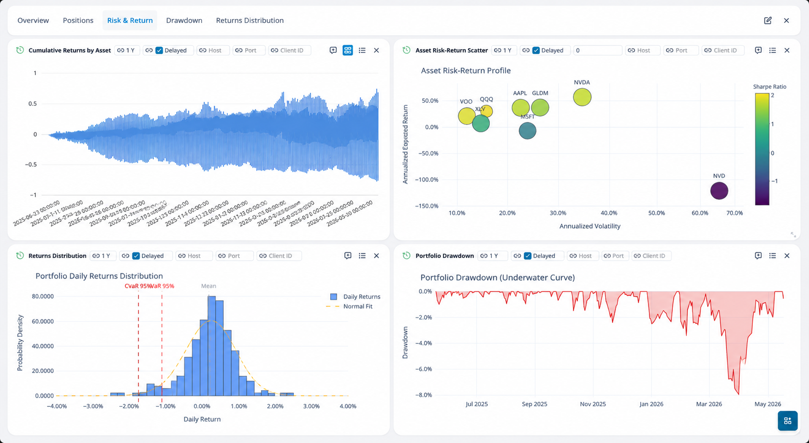

# openbb-ibkr

[](https://pypi.org/project/openbb-ibkr/)
[](https://opensource.org/licenses/MIT)
[](https://www.python.org/downloads/)
[](https://github.com/alwank/openbb-ibkr/actions/workflows/ci.yml)

Interactive Brokers (IBKR) provider extension for the [OpenBB Platform](https://openbb.co). Connects your IBKR portfolio data — positions, account summary, margin, orders, trades, and market data — directly into OpenBB.

## Features

- **Portfolio positions** — Symbol, quantity, market value, average cost, unrealized/realized P&L
- **Account summary** — Net liquidation, cash balances, buying power
- **Margin data** — Initial/maintenance margin, available funds, excess liquidity, cushion
- **Leverage analysis** — Compare pro-rata vs targeted leverage-up scenarios with shock tables and carry estimates
- **Orders & trades** — Open/completed orders and full trade history with fill-level detail
- **Market data** — Real-time/delayed quotes and historical bars (supports TRADES, MIDPOINT, BID, ASK, OPTION_IMPLIED_VOLATILITY, HISTORICAL_VOLATILITY)
- **Multi-asset quotes** — FX, bonds, mutual funds, crypto, CFDs, commodities via IBKR-specific routes
- **Contract search** — Symbol/contract lookup with metadata, conId resolution, and multi-asset support
- **Options** — Chain lookup, screener with Greeks, decision signals (IV/RV, skew, flow), and live tick-by-tick flow monitoring
- **Option decision signals** — IV/RV ratio, put-call skew, flow bias, trade suitability labels
- **IV gap-filling** — Falls back to yFinance and IBKR `calculateImpliedVolatility` when market IV is unavailable
- **Riskfolio optimization** *(optional)* — Mean-variance optimization, risk contribution, drawdown analysis, tail risk, correlation heatmap
- **Plotly visualization** *(optional)* — Treemaps, equity curves, drawdown charts, correlation heatmaps, returns distributions, risk-return scatter plots
- **OpenBB Workspace widgets** — Every table and chart command ships with pre-configured widget metadata for the OpenBB Workspace UI
- **Per-request connection override** — Override host/port/client_id on individual calls

## Requirements

- **OpenBB Platform v4** installed
- **TWS** or **IB Gateway** running with API connections enabled
- Python 3.10+

## Installation

```bash
pip install openbb-ibkr
```

With Riskfolio portfolio optimization:

```bash
pip install openbb-ibkr[riskfolio]
```

Then rebuild the OpenBB package to register the extension:

```bash
openbb-build
```

> **Important:** The `openbb-build` step is required after installing any new OpenBB extension.

### Uninstalling

```bash
pip uninstall openbb-ibkr
openbb-build
```

## Configuration

```python
from openbb import obb

obb.user.credentials.ibkr_host = "127.0.0.1"
obb.user.credentials.ibkr_port = "7497"   # 7496 for IB Gateway, 7497 for TWS
obb.user.credentials.ibkr_client_id = "1"
obb.user.credentials.ibkr_delayed = True   # Use delayed (non-subscribed) market data by default
```

You can also override connection parameters per-request via `host`, `port`, and `client_id` parameters on any command — useful for switching between accounts or environments.

## TWS / IB Gateway Setup

To allow this extension to connect, enable the API in your IBKR client:

1. In TWS: **Edit → Global Configuration → API → Settings**
2. Check **"Enable ActiveX and Socket Clients"**
3. Add `127.0.0.1` to **Trusted IPs** (or uncheck "Allow connections from localhost only" for remote access)
4. Note the **Socket port** — defaults:

| Client | Live | Paper |
|--------|------|-------|
| TWS | 7496 | 7497 |
| IB Gateway | 4001 | 4002 |

> **Tip:** IB Gateway is lighter-weight and preferred for automated/headless setups.

## OpenBB Workspace Integration



All IBKR commands ship with pre-configured **widget metadata** for the OpenBB Workspace UI. Table commands include column definitions, chart views (bar, treemap, scatter, grouped bar, line), and grid layouts. Chart commands return Plotly JSON that renders natively in Workspace dashboards.

### Setting Up Widgets in OpenBB Workspace

1. Start the OpenBB API server: `openbb-api`
2. Connect your custom backend in [OpenBB Workspace](https://pro.openbb.co)
3. Find widgets under the **IBKR** category
4. Browse subcategories (Portfolio, Market Data, FX, Options, Riskfolio, etc.) and drag widgets onto your layout — tables include built-in chart views (bar, treemap, scatter)
5. Chart widgets (Plotly) render natively — no extra configuration needed

### Available Widgets

| Widget | Type | subCategory | widgetId |
|-----|-----|-----|-----|
| IBKR Market Quote | table | Market Data | `ibkr_market_quote_custom_obb` |
| IBKR FX Spot Quote | table | FX | `ibkr_fx_quote_custom_obb` |
| IBKR Bond Quote | table | Bonds | `ibkr_bond_quote_custom_obb` |
| IBKR Mutual Fund Quote | table | Funds | `ibkr_fund_quote_custom_obb` |
| IBKR Crypto/Paxos Quote | table | Crypto | `ibkr_crypto_quote_custom_obb` |
| IBKR CFD Quote | table | CFDs | `ibkr_cfd_quote_custom_obb` |
| IBKR Metals/Commodity Quote | table | Commodities | `ibkr_commodity_quote_custom_obb` |
| IBKR Contract Search | table | Contracts | `ibkr_contract_search_custom_obb` |
| IBKR Contract Details | table | Contracts | `ibkr_contract_details_custom_obb` |
| IBKR Option Screener | table | Options | `ibkr_option_screener` |
| IBKR Option Decision Signals | table | Options | `ibkr_option_decision_signals_custom_obb` |
| Riskfolio Allocation Table | table | Riskfolio | `ibkr_riskfolio_allocation_table_custom_obb` |
| Riskfolio Allocation Treemap | chart | Riskfolio | `ibkr_riskfolio_allocation_treemap_custom_obb` |
| Historical NAV and Exposure | chart | Riskfolio | `ibkr_riskfolio_equity_curve_plotly_custom_obb` |
| Portfolio Drawdown | chart | Riskfolio | `ibkr_riskfolio_drawdown_plotly_custom_obb` |
| Risk Contribution Scatter | chart | Riskfolio | `ibkr_riskfolio_risk_contribution_scatter_plotly_custom_obb` |
| Asset Risk-Return Scatter | chart | Riskfolio | `ibkr_riskfolio_asset_risk_return_scatter_plotly_custom_obb` |
| Correlation Heatmap | chart | Riskfolio | `ibkr_riskfolio_correlation_heatmap_plotly_custom_obb` |
| +12 more table/chart widgets | — | Riskfolio | `ibkr_riskfolio_*_custom_obb` |

## Usage

### Portfolio & Account

```python
from openbb import obb

# Current positions with P&L
positions = obb.ibkr.positions()
print(positions.to_dataframe())

# Account summary
summary = obb.ibkr.account_summary().to_dataframe()

# Margin details
margin = obb.ibkr.margin_summary()
```

### Orders & Trades

```python
orders = obb.ibkr.open_orders().to_dataframe()
completed = obb.ibkr.completed_orders().to_dataframe()
trades = obb.ibkr.trades().to_dataframe()
```

### Market Data

```python
# Via IBKR router
obb.ibkr.quote(symbol="AAPL")
obb.ibkr.historical(symbol="AAPL", duration="1 M", bar_size="1 day")

# Via OpenBB standard routers (provider="ibkr")
obb.equity.price.quote(symbol="AAPL", provider="ibkr")
obb.equity.price.historical(symbol="AAPL", provider="ibkr")

# Multi-asset with full contract resolution
obb.ibkr.market_quote(symbol="BTC", sec_type="CRYPTO", exchange="PAXOS")
obb.ibkr.fx_quote(symbol="EUR.USD")
obb.ibkr.bond_quote(symbol="US912828Z864", con_id=123456)  # con_id for unambiguous resolution
obb.ibkr.crypto_quote(symbol="BTC")
obb.ibkr.cfd_quote(symbol="IBUS40")
obb.ibkr.commodity_quote(symbol="XAUUSD")
obb.ibkr.fund_quote(symbol="VFIAX")

# Multi-asset historical
obb.ibkr.market_historical(symbol="BTC", sec_type="CRYPTO", duration="1 M")

# Contract lookup
obb.ibkr.contract_search(symbol="AAPL")
obb.ibkr.contract_details(symbol="AAPL")
```

### Connection Status

```python
obb.ibkr.is_connected()
# Returns: OBBject(results={'connected': True})
```

### Options

```python
# Option chain
chain = obb.ibkr.option_chain(symbol="AAPL")

# Screener with Greeks and signals
screener = obb.ibkr.option_screener(symbol="AAPL", min_dte=7, max_dte=45)

# Decision signals (IV/RV, skew, flow bias, trade suitability)
signals = obb.ibkr.option_decision_signals(symbol="AAPL")
```

### Option Flow (live monitoring)

Monitors tick-by-tick option trades and aggregates session-to-date flow statistics (requires real-time market data subscription):

```python
# Requires existing option contracts from the screener
chain = obb.ibkr.option_screener(symbol="AAPL").results

# Subscribe and aggregate live flow
flow = obb.ibkr.option_flow(contracts=chain)
# Returns totals, per-contract breakdown, and by-strike aggregation
```

### Visualization (Plotly charts, optional)

Requires `pip install openbb-ibkr[riskfolio]`. Charts return Plotly JSON for native rendering in notebooks or Workspace dashboards:

```python
# Portfolio allocation treemap sized by market value, colored by P&L %
fig = obb.ibkr.riskfolio_allocation_treemap()

# Historical NAV and exposure line chart
fig = obb.ibkr.riskfolio_equity_curve(duration="1 Y")

# Underwater drawdown area chart
fig = obb.ibkr.riskfolio_drawdown(duration="1 Y")

# Return correlation heatmap
fig = obb.ibkr.riskfolio_correlation(duration="1 Y")

# Daily returns distribution with normal overlay and VaR/CVaR markers
fig = obb.ibkr.riskfolio_returns_distribution(duration="1 Y")

# Asset risk-return scatter (volatility vs expected return, sized by weight)
fig = obb.ibkr.riskfolio_asset_risk_return_scatter(duration="1 Y")

# Risk contribution scatter (weight vs risk contribution)
fig = obb.ibkr.riskfolio_risk_contribution_scatter(duration="1 Y")

# Cumulative returns by asset (multi-line chart)
fig = obb.ibkr.riskfolio_cumulative_returns(duration="1 Y")

# CVaR tail risk contribution bar chart
fig = obb.ibkr.riskfolio_tail_risk_contribution_bar(duration="1 Y")
```

### Riskfolio Optimization (optional)

Requires `pip install openbb-ibkr[riskfolio]`.

```python
# Holdings with inclusion/exclusion status
holdings = obb.ibkr.riskfolio_holdings()

# Current allocation table
allocation = obb.ibkr.riskfolio_allocation()

# Current vs optimized weights
weights = obb.ibkr.riskfolio_optimized_weights(duration="1 Y", risk_free_rate=0.0)

# Risk metrics comparison (current vs optimized: return, vol, Sharpe, Sortino, VaR, CVaR)
metrics = obb.ibkr.riskfolio_metrics(duration="1 Y")

# Volatility risk contribution by symbol
contrib = obb.ibkr.riskfolio_risk_contribution(duration="1 Y")

# Tail risk contribution (CVaR-based)
tail = obb.ibkr.riskfolio_tail_risk_contribution(duration="1 Y")

# Asset-level risk-return data
risk_return = obb.ibkr.riskfolio_asset_risk_return(duration="1 Y")

# Drawdown time series table
drawdown = obb.ibkr.riskfolio_drawdown_table(duration="1 Y")

# Cumulative returns by asset (long-format table)
cumulative = obb.ibkr.riskfolio_cumulative_returns_table(duration="1 Y")

# Daily returns histogram bins
distribution = obb.ibkr.riskfolio_returns_distribution_table(duration="1 Y")

# Levered constrained optimization with sleeve bounds
levered = obb.ibkr.riskfolio_leverage_target(
    target_leverage=1.4,
    risk_free_rate=0.0,
    max_weight=0.2,
    duration="1 Y",
)
```

## API Reference

| Command | Description |
|-----|-----|
| `configure(host, port, client_id, delayed)` | Set IBKR connection parameters |
| `account_summary()` | All account tags (NetLiquidation, Cash, BuyingPower, etc.) |
| `margin_summary()` | Margin requirements with full/lookahead variants |
| `account_values()` | Account tags organized by currency |
| `positions()` | Portfolio positions with P&L and contract details |
| `position_detail(symbol)` | Single position detail |
| `leverage_analysis(...)` | Leverage scenario analysis with shock/carry tables |
| `open_orders()` | Current open orders |
| `completed_orders(api_only)` | Completed orders (session or all) |
| `trades()` | Trade history with fill-level detail and commissions |
| `is_connected()` | TWS/IB Gateway connection status |
| `quote(symbol, delayed)` | Real-time/delayed equity quote |
| `historical(symbol, duration, bar_size, what_to_show, use_rth)` | Historical bars |
| `market_quote(symbol, sec_type, exchange, currency, con_id, ...)` | Multi-asset quote |
| `market_historical(symbol, sec_type, ...)` | Multi-asset historical bars |
| `contract_search(symbol, sec_type, con_id, ...)` | Contract lookup |
| `contract_details(symbol, sec_type, ...)` | Contract metadata |
| `fx_quote(symbol)` | IDEALPRO FX spot quote |
| `bond_quote(symbol, con_id)` | Bond quote |
| `fund_quote(symbol)` | Mutual fund quote |
| `crypto_quote(symbol)` | Paxos crypto quote |
| `cfd_quote(symbol, con_id)` | CFD quote |
| `commodity_quote(symbol)` | Commodity/metals quote |
| `option_chain(symbol, min_dte, max_dte, max_strikes)` | Option chain contract definitions |
| `option_screener(symbol, min_dte, max_dte, right, ...)` | Option screener with Greeks |
| `option_decision_signals(symbol, ...)` | IV/RV, skew, flow signals with trade suitability |
| `option_flow(contracts, ...)` | Live tick-by-tick option flow monitoring |
| `riskfolio_holdings()` | Holdings with inclusion/exclusion status |
| `riskfolio_allocation()` | Chart-friendly current allocation table |
| `riskfolio_allocation_treemap(theme)` | Plotly allocation treemap |
| `riskfolio_metrics(duration, risk_free_rate, max_weight)` | Current vs optimized risk metrics |
| `riskfolio_optimized_weights(duration, ...)` | Current vs optimized weights |
| `riskfolio_risk_contribution(duration)` | Volatility risk contribution by symbol |
| `riskfolio_risk_contribution_scatter(duration, theme)` | Plotly risk contribution scatter |
| `riskfolio_tail_risk_contribution(duration)` | CVaR-based tail risk contribution |
| `riskfolio_tail_risk_contribution_bar(duration, theme)` | Plotly tail risk contribution bar |
| `riskfolio_asset_risk_return(duration, risk_free_rate)` | Asset risk-return scatter data |
| `riskfolio_asset_risk_return_scatter(duration, theme)` | Plotly risk-return scatter |
| `riskfolio_correlation(duration, theme)` | Plotly correlation heatmap |
| `riskfolio_equity_curve(duration, theme)` | Plotly historical NAV and exposure |
| `riskfolio_drawdown_table(duration)` | Drawdown time series table |
| `riskfolio_drawdown(duration, theme)` | Plotly underwater drawdown chart |
| `riskfolio_cumulative_returns_table(duration)` | Cumulative returns by asset (table) |
| `riskfolio_cumulative_returns(duration, theme)` | Plotly cumulative returns chart |
| `riskfolio_returns_distribution_table(duration)` | Returns histogram bins (table) |
| `riskfolio_returns_distribution(duration, theme)` | Plotly returns histogram |
| `riskfolio_leverage_target(target_leverage, ...)` | Constrained levered optimization |

## Package Structure

```
openbb_ibkr/
├── __init__.py              # Provider registration
├── ibkr_router.py           # Router commands
├── models/
│   ├── market_data.py       # OpenBB fetchers (EquityQuote, EquityHistorical)
│   └── response_models.py   # Response data models
└── utils/
    ├── client.py            # IBKR connection manager (ib_insync wrapper)
    ├── options_signals.py   # Option decision signal computation
    └── iv_fallback.py       # IV gap-filling via yFinance fallback
```

## Troubleshooting

| Problem | Solution |
|---------|----------|
| `ConnectionRefusedError` | Ensure TWS/IB Gateway is running and API is enabled (see [TWS Setup](#tws--ib-gateway-setup)) |
| Wrong port | TWS paper = 7497, TWS live = 7496, Gateway live = 4001, Gateway paper = 4002 |
| "No market data permissions" | Set `delayed=True` in credentials or subscribe to market data in Account Management |
| Extension not found after install | Re-run `openbb-build` to register the extension |
| "Client ID already in use" | Each concurrent connection needs a unique `client_id` — change via credentials or per-request override |

## Known Limitations

- **One connection per client_id** — concurrent scripts must use different `client_id` values
- **IBKR rate limit** — ~50 messages/sec; bulk requests may need throttling
- **Real-time data requires subscriptions** — without a market data subscription, set `delayed=True` for free 15-min delayed quotes
- **Option flow monitoring** — requires a real-time options data subscription
- **Riskfolio optimization** — uses historical returns; results are not forward-looking guarantees

## Development

```bash
git clone https://github.com/alwank/openbb-ibkr.git
cd openbb-ibkr
pip install -e .[dev]
pytest tests/ -v
```

## Contributing

See [CONTRIBUTING.md](CONTRIBUTING.md) for guidelines.

## Security

This extension communicates **only** with your local TWS/IB Gateway instance — no data is sent to external servers. Credentials are stored locally in OpenBB's user settings file.

## Changelog

See [CHANGELOG.md](CHANGELOG.md) for release history.

## License

MIT — see [LICENSE](LICENSE).
